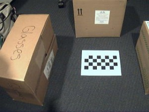

# Vision Estereoscopica
Trabajo Final de Computacion Grafica
# Integrantes
- Quispe Huaman, Kevin Percy
- Sapacayo Garcia, Felipe
- Rodriguez Saico, Frank
# Prueba 1
Imagen Original 
 
Imagen procesado 
 

# Prueba 2
Imagen Original 
 
Imagen procesado 1 
 
Imagen procesado 2 - ROTADO 
 
